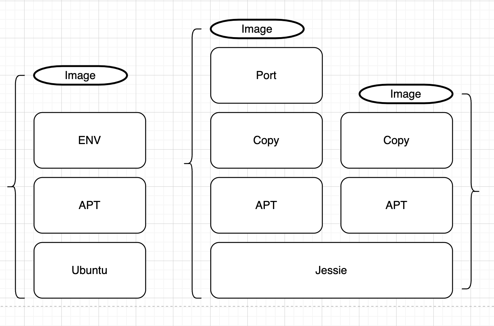
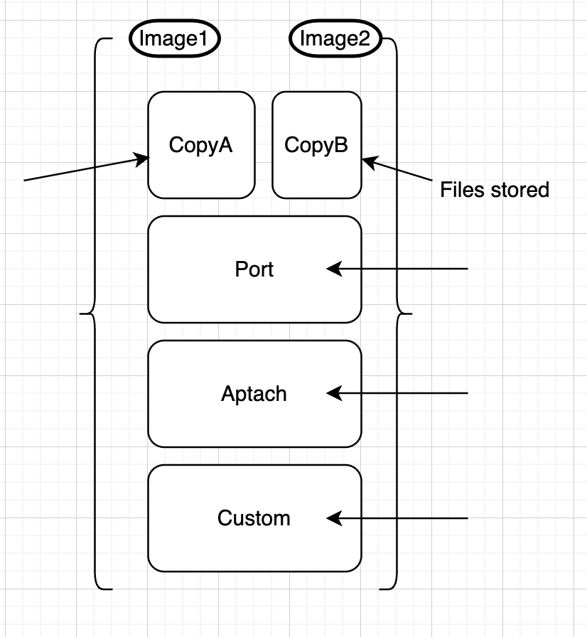

https://labs.play-with-docker.com/

$ docker run -d -p 8800:80 httpd
-p change port from 80 to 8800 outside container

# why docker 
- Isolation (in a single OS)
- Envirements (reduced env viroes)
- Speed(buessines)

docker
docker version
docker info

docker container run --publish 80:80 nginx
docker container run --publish 80:80 --detach nginx    running in background

docker container ls
docker container stop 89e     89e is first 3 digits of container ID
docker container ls -a

docker container run --publish 80:80 --detach --name web123 nginx         give the container a spec name
docker container run --publish 80:80 --name web123 -d nginx:1.11 nginx -T   Version of image, change CMD run on start  

docker container logs web123     logs

docker container top web123      process running inside a container

docker container --help

docker container rm 283 6b2 89e 
docker container rm -f 6b2

# 20. Container VS VM
docker run --name mongo -d mongo
ps aux     showing all process
docker start mongo
docker top mongo
ps aux | grep mongo

# 22. Assignment multi containers
docker run --name mysql -d -p 3306:3306 --env MYSQL_RANDOM_ROOT_PASSWORD=yes mysql

#23
docker ps -a === docker container ls -a
docker image ls     show all images

# 24 What's going on in containers?
docker container top   ---process list in one container
docker container inspect  ---- details of one container config
docker container stats ---- performence stats for all containers

# 26 Getting a Shell Inside Containers
 By using the 'docker exec -it <container> sh' (or bash) command on a container, we can connect to a shell from inside it.
docker container run -it  -start new container interactively(when exit the container stop running)
docker container exec -it   - run additional command in existing container(exit will not kill the container running)

 docker container run -it --name proxy nginx bash
 docker container start -ai ubuntu(start a exist container with promt cli)

 docker pull alpine - pull alpine image
 docker image ls

 docker container run -it alpine sh 

 # 27 Docker networks: concepts
 docker container run -p
 docker container port <container>
 "Batteries Includet, But removable"

 docker container port webhost
 docker container inspect --format --- a common option for formatting the output of commands using "Go templates"

docker container inspect --format '{{ .NetworkSettings.IPAddress }}' webhost

docker networks: brige/docker0

docker container run -d --name webhost -p 80:80 nginx:alpine

# 29 Docker networks: cli management
docker network ls --- show networks
docker network inspect --- inspect a network
docker network create --driver  ---- create a network
docker network connect --- attach a network to container
docker network disconnect --- detach a network from container

# 30 Docker networksL: DNS
docker use container names as equivalent of a host name for containers talking to each ohter

docker container exec -it new_nginx ping my_nginx

#31 Assigment: CLI App Testing
docker container run --name centos7 --rm -it centos:7 bash
docker container exec -it centos7 bash

# 34  Assignment DNS Round Robin Test
docker run -e "discovery.type=single-node" -e "ES_JAVA_OPTS=-Xms512m -Xmx512m" -e "xpack.security.enabled=false" --network <your_network> -d --network-alias search elasticsearch:8.4.3
docker run -it --rm --network rrtest alpine shß

# 35 Docker hub(hub.docker.com)

# 38 Image Layers

docker history nginx:latest  (history of image layers)

docker image inspect    -> show json meta data of the image

# 39 Image tags and push. How to upload to Docker Hub. Image ID vs Tag

Tags are only labels point to the image, so one image may has multiply tags at the same time(numbers and strs)

#### Retag the image
docker image tag nginx bretfisher/nginx

docker image tag ubuntu hudir/ubuntu
docker image push hudir/ubuntu
docker login

cat .docker/config.json
docker image tag hudir/ubuntu hudir/ubuntu:testing

# 40 building Images: The Dockerfile
deal with docker file in command line with -f, e.g. docker build -f some-dockerfile

ues && to chain shall command to make suer all of them are in same layer

# 41 Building Images Running Docker Builds
docker image build -t customnginx . (name)

# 42 copy the html file in to container

docker image build -t nginx-with-html .
docker image tag nginx-with-html:latest hudir/nginx-with-html:latest

# 43 Assignment 1 
docker image build -t node-alpine .
docker container run -p 80:3000 node-alpine
docker image tag node-alpine:latest hudir/node-alpine:latest
docker image push hudir/node-alpine
docker image rm hudir/node-alpine
docker container run -p 80:3000 hudir/node-alpine

#44 Using Prune to keep Docker System clean
docker image prune to clean up just "dangling" images
docker system prune will clean up everything you're not currently using
The big one is usually docker image prune -a which will remove all images you're not using. Use docker system df to see space usage.

Here's a YouTube video I made about it: https://youtu.be/_4QzP7uwtvI

# 46 Container Lifetime & Persistent Data
- container are usually immutable and ephemeral
- Design goal -> only re-deploy containers, never change
- Unique data(database or sth)
- 